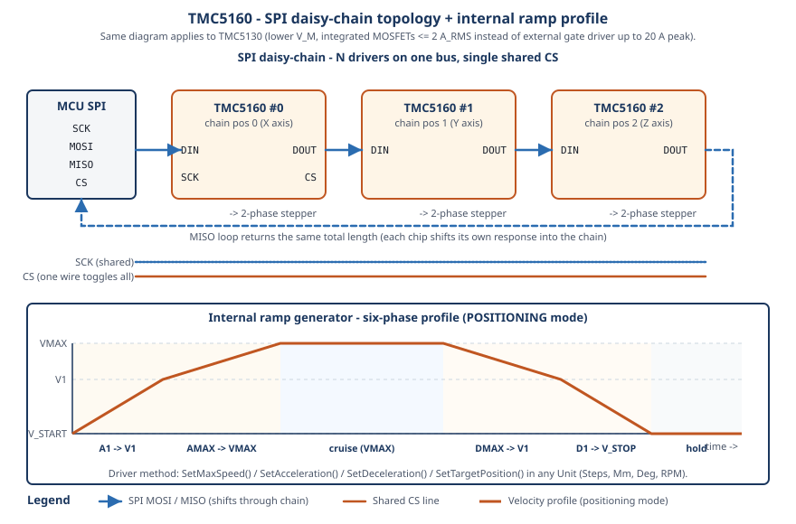

# HF-TMC51x0 Driver (TMC5130 & TMC5160)
**C++17 hardware-agnostic driver for Trinamic TMC51x0 stepper motor controllers (TMC5130 & TMC5160) with advanced features**

[](https://en.cppreference.com/w/cpp/17.html)
[](https://www.gnu.org/licenses/gpl-3.0)
[](https://github.com/N3b3x/hf-tmc5160-driver/actions/workflows/esp32-examples-build-ci.yml)
[](https://n3b3x.github.io/hf-tmc5160-driver/)

## 📚 Table of Contents
1. [Overview](#-overview)
2. [Features](#-features)
3. [Quick Start](#-quick-start)
4. [Installation](#-installation)
5. [API Reference](#-api-reference)
6. [Examples](#-examples)
7. [Documentation](#-documentation)
8. [Contributing](#-contributing)
9. [License](#-license)

## 📦 Overview

> **📖 [📚🌐 Live Complete Documentation](https://n3b3x.github.io/hf-tmc5160-driver/)** -
> Interactive guides, examples, and step-by-step tutorials

**HF-TMC51x0** is a comprehensive, production-ready C++17 driver for the **Trinamic TMC51x0** stepper motor controller ICs (TMC5130 & TMC5160). 
The TMC51x0 family includes sophisticated stepper motor drivers supporting advanced features including stealthChop for silent operation, 
spreadCycle for high torque, StallGuard2 for stall detection, and encoder support for closed-loop control. 

This driver provides **complete feature coverage** of all 47 TMC51x0 registers with **100+ public API methods** organized into 
intuitive, well-structured subsystems. It supports **multi-chip communication** via SPI daisy chaining and UART multi-node 
addressing, **physical unit conversions** (mm, degrees, RPM, belt teeth), **automatic parameter tuning**, **sensorless homing**, 
and many other advanced features not found in other TMC51x0 drivers. The driver **automatically detects** and supports both TMC5130 and TMC5160 chips.



### Architecture & Design

The driver is built with a **subsystem-based architecture** that organizes functionality into logical groups, making it easy 
to find and use the features you need:

```cpp
tmc51x0::TMC51x0<MySPI> driver(spi);

// Organized subsystems for intuitive access
driver.rampControl      // Motion planning, positioning, and velocity control
driver.motorControl     // Current control, chopper modes, StealthChop
driver.switches         // Reference switches / endstops
driver.thresholds       // Mode-change speed thresholds (StealthChop, CoolStep, high-speed)
driver.stallGuard       // StallGuard2 reading, stop-on-stall
driver.status           // Driver status, diagnostics, temperature, open-load detection
driver.tuning           // Automatic StallGuard2 threshold optimization
driver.homing           // Sensorless, switch-based, and encoder homing; bounds finding
driver.encoder          // ABN encoder integration and deviation detection
driver.powerStage       // Short-circuit and overtemperature protection
driver.communication    // Clock, SPI daisy-chain, UART node addressing
driver.io               // IOIN register, operating mode pins
driver.events           // X_COMPARE position events
driver.printer          // Debug register printing (GCONF, DRV_STATUS, etc.)
```

The driver uses **CRTP (Curiously Recurring Template Pattern)** for hardware-agnostic communication interfaces, allowing it 
to run on any platform (ESP32, STM32, Arduino, Raspberry Pi, etc.) with SPI or UART. This design provides **zero runtime 
overhead** while maintaining complete platform independence.

### Key Capabilities

- **Complete Register Coverage**: All 47 TMC51x0 registers (0x00-0x73) accessible through type-safe C++ API
- **Multi-Chip Support**: SPI daisy chaining and UART multi-node addressing for controlling multiple motors
- **Unit Conversions**: Work with physical units (mm, degrees, RPM) instead of raw steps
- **Automatic Tuning**: Intelligent StallGuard2 threshold optimization with velocity range analysis
- **Sensorless Homing**: Endstop-free homing using StallGuard2 stall detection
- **Dual Chip Support**: Automatically detects and supports both TMC5130 and TMC5160 chips
- **Modern C++17**: Type-safe API with RAII principles and compile-time optimizations

### 🔀 Chip Compatibility

The driver targets the entire TMC51x0 family with a single class. Chip-specific features
degrade gracefully with `ErrorCode::UNSUPPORTED` when called on a chip that lacks them.

| Feature                                | TMC5130 | TMC5160 |
|----------------------------------------|---------|---------|
| Internal motion controller (ramp gen)  | ✅      | ✅      |
| StealthChop2 / SpreadCycle / CoolStep  | ✅      | ✅      |
| StallGuard2 sensorless load detection  | ✅      | ✅      |
| ABN encoder + index homing             | ✅      | ✅      |
| SPI daisy-chain / UART multi-node      | ✅      | ✅      |
| Integrated MOSFETs (≤ 2 A_RMS)         | ✅      | —       |
| External gate driver (≤ 20 A peak)     | —       | ✅      |
| Higher V_M range                       | up to 46 V | up to 60 V |
| Short-to-supply / short-to-GND protect | basic   | advanced (S2VS / S2G levels) |
| Power-stage configuration (DRV_CONF)   | limited | full     |

Chip detection is automatic during `Initialize()`. See
[docs/tmc5130_support.md](docs/tmc5130_support.md) for the complete differences list.

## ✨ Features

### 🎯 Core Motor Control

#### RampControl Subsystem
- ✅ **Positioning Mode**: Precise position control with configurable acceleration profiles
- ✅ **Velocity Mode**: Continuous motion in positive or negative direction
- ✅ **Hold Mode**: Maintain position with configurable hold current
- ✅ **Advanced Ramp Profiles**: Multi-phase acceleration (A1, AMAX, D1) for smooth motion
- ✅ **Reference Switches**: Configurable endstops with latching and stop-on-switch modes
- ✅ **Unit-Aware API**: Set positions, speeds, and accelerations in steps, mm, degrees, RPM, or revolutions per second (RevPerSec - default for velocities)

#### MotorControl Subsystem
- ✅ **Current Control**: Automatic calculation from motor specifications (rated current, sense resistor)
- ✅ **Run/Hold Currents**: Independent run and hold current settings with global scaler
- ✅ **Chopper Modes**: 
  - **spreadCycle**: High torque mode with configurable chopper settings
  - **stealthChop**: Silent operation with automatic PWM amplitude scaling
- ✅ **Mode Switching**: Automatic switching between stealthChop and spreadCycle based on velocity
- ✅ **Freewheeling**: Automatic freewheeling when motor is stopped

### 🔍 Diagnostics & Tuning

#### Status Subsystem (`driver.status`)
- ✅ **Status Monitoring**: Comprehensive driver status (overtemperature, short circuit, etc.)
- ✅ **Open Load Detection**: Detect interrupted cables or connector issues
- ✅ **Lost Steps Counter**: Monitor step loss during operation
- ✅ **Setup Verification**: Comprehensive startup verification and diagnostics (`VerifySetup()`)

#### StallGuard Subsystem (`driver.stallGuard`)
- ✅ **StallGuard2 Reading**: Real-time load measurement (0-1023) for diagnostics
- ✅ **Stop on Stall**: Configure automatic stop when stall is detected
- ✅ **Soft Stop**: Deceleration ramp on stall instead of hard stop

#### Tuning Subsystem (`driver.tuning`)
- ✅ **Automatic SGT Tuning**: Intelligent StallGuard2 threshold optimization
- ✅ **Velocity Range Analysis**: Finds optimal SGT for target velocity with min/max range testing
- ✅ **Comprehensive Results**: Returns detailed tuning results including actual achievable velocities
- ✅ **Target Velocity Priority**: Optimizes SGT primarily for your most important operating speed

### 🏠 Homing & Positioning

#### Homing Subsystem (`driver.homing`)
- ✅ **Sensorless Homing**: Endstop-free homing using StallGuard2 stall detection
- ✅ **Switch-Based Homing**: Homing using reference switches/endstops
- ✅ **Encoder Index Homing**: Homing to encoder N-channel index pulse
- ✅ **Bounds Finding**: Detect mechanical limits and home to center, min, or max (`FindBounds()`)
- ✅ **Automatic Settings Caching**: Preserves and restores driver settings during homing
- ✅ **Cancel Callback**: Abort homing mid-operation via user-provided callback

### 🔄 Encoder Integration

#### Encoder Subsystem
- ✅ **Closed-Loop Control**: Encoder feedback for position verification
- ✅ **Deviation Detection**: Monitor and detect position deviation (step loss)
- ✅ **Automatic Compensation**: Optional automatic position correction
- ✅ **Encoder Configuration**: Flexible encoder setup (AB, ABZ, SPI, etc.)

### 🛡️ Protection Systems

#### PowerStage Subsystem (`driver.powerStage`)
- ✅ **Short Circuit Protection**: Configurable S2VS and S2G voltage thresholds
- ✅ **Power Stage Configuration**: MOSFET drive strength, break-before-make timing
- ✅ **Overtemperature Protection**: Automatic shutdown on overtemperature (monitored via `driver.status`)

### 🔗 Multi-Chip Communication

#### Communication Subsystem
- ✅ **SPI Daisy Chaining**: Connect multiple TMC51x0 chips on a single SPI bus
  - Automatic chain length detection
  - Position-based addressing (0, 1, 2, ...)
  - `TMC51x0DaisyChain` helper class for easy management
- ✅ **UART Multi-Node**: Support for up to 255 devices on a single UART bus
  - Node addressing (0-254)
  - Sequential programming support
  - `TMC51x0MultiNode` helper class for multi-device management
- ✅ **Automatic Detection**: Chip version detection (TMC5130 vs TMC5160)

### ⚙️ Advanced Features

- ✅ **CoolStep**: Automatic current reduction when load is low for power efficiency
- ✅ **dcStep**: Automatic commutation for DC motor-like operation
- ✅ **Microstep Lookup Tables**: Custom microstep interpolation for optimized motion profiles
- ✅ **Unit Conversions**: Physical unit support (millimeters, degrees, RPM, belt teeth)
  - Lead screw systems (mm pitch)
  - Belt drive systems (belt pitch, pulley teeth)
  - Direct drive and gearbox systems
- ✅ **OTP Programming**: One-time programmable memory read/write support
- ✅ **Factory Configuration**: Read factory calibration and configuration data
- ✅ **Motor Setup from Specs**: High-level configuration from physical motor parameters

### 🏗️ Platform & Architecture

- ✅ **Hardware Agnostic**: SPI or UART interface for complete platform independence
- ✅ **CRTP Design**: Zero-overhead compile-time polymorphism
- ✅ **Template-Based**: Type-safe API with compile-time optimizations
- ✅ **Modern C++17**: RAII principles, constexpr functions, type safety
- ✅ **Complete Register Coverage**: All 47 registers (0x00-0x73) with 100+ public API methods
- ✅ **Subsystem Organization**: Logical grouping of functionality for easy discovery

## 🚀 Quick Start

```cpp
#include "inc/tmc51x0.hpp"

// 1. Implement the SPI/UART communication interface for your platform.
//    See docs/platform_integration.md for full ESP32/STM32/Arduino templates.
class MySPI : public tmc51x0::SpiCommInterface<MySPI> {
public:
    tmc51x0::Result<void> SpiTransfer(const uint8_t* tx, uint8_t* rx, size_t length) noexcept;
    tmc51x0::Result<void> GpioSet(tmc51x0::TMC51x0CtrlPin pin, tmc51x0::GpioSignal sig) noexcept;
    tmc51x0::Result<tmc51x0::GpioSignal> GpioRead(tmc51x0::TMC51x0CtrlPin pin) noexcept;
    void DelayMs(uint32_t ms) noexcept;
    void DelayUs(uint32_t us) noexcept;
protected:
    void DebugLog(int level, const char* tag, const char* fmt, va_list args) noexcept;
};

// 2. Create driver instance
MySPI spi;
tmc51x0::TMC51x0<MySPI> driver(spi);

// 3. Initialize from motor spec — IRUN, IHOLD, and GLOBAL_SCALER are auto-calculated
tmc51x0::DriverConfig cfg{};
cfg.motor_spec.rated_current_ma   = 2000;   // 2 A rated current
cfg.motor_spec.sense_resistor_mohm = 50;    // 0.05 Ω sense resistor
cfg.motor_spec.supply_voltage_mv  = 24000;  // 24 V supply
if (auto r = driver.Initialize(cfg); !r) { /* handle r.ErrorMessage() */ return; }

// 4. Enable and run a positioning move
driver.motorControl.Enable();
driver.rampControl.SetRampMode(tmc51x0::RampMode::POSITIONING);
driver.rampControl.SetMaxSpeed(60.0f, tmc51x0::Unit::RPM);
driver.rampControl.SetAcceleration(5.0f, tmc51x0::Unit::RevPerSec);
driver.rampControl.SetTargetPosition(180.0f, tmc51x0::Unit::Deg);   // move to 180°
```

For a fully-stubbed `MySPI` template plus daisy-chain, units, and `Result<T>` patterns,
see [docs/quickstart.md](docs/quickstart.md), [docs/platform_integration.md](docs/platform_integration.md),
and the [Multi-chip / Units / Error-handling cookbook](docs/special_features_multi_chip.md).

> **`Result<T>` pattern**: every method returns a lightweight `Result<T>` carrying
> either a value or an `ErrorCode` (no exceptions). Check with `if (auto r = ...; !r)`
> or `r.IsOk()`. Full code list and `Value()` / `ValueOr()` patterns are in
> [docs/troubleshooting.md](docs/troubleshooting.md). Quick Start above omits checks
> for brevity — production code should always inspect the result.

## 🔧 Installation

1. **Clone or copy** the driver files into your project
2. **Implement the communication interface** for your platform (see [Platform Integration](docs/platform_integration.md))
3. **Include the header** in your code:
   ```cpp
   #include "inc/tmc51x0.hpp"
   ```
4. Compile with a **C++17** or newer compiler

For detailed installation instructions, see [docs/installation.md](docs/installation.md).

## 📖 API Reference

> All methods return `Result<T>` types. Check with `IsOk()` / `operator bool` before using `Value()`. See the [full API Reference](docs/api_reference.md) for complete signatures and return types, and [docs/troubleshooting.md](docs/troubleshooting.md) for the full `ErrorCode` list.

### Class Structure & Subsystems

The `TMC51x0` class is organized into intuitive subsystems for easy access to functionality:

```cpp
tmc51x0::TMC51x0<MySPI> driver(spi);
using Unit = tmc51x0::Unit;
using Homing = tmc51x0::TMC51x0<MySPI>::Homing;

// --- Motion Control ---
driver.rampControl.SetRampMode(tmc51x0::RampMode::POSITIONING);
driver.rampControl.SetMaxSpeed(60.0f, Unit::RPM);
driver.rampControl.SetAcceleration(5.0f, Unit::RevPerSec);
driver.rampControl.SetDeceleration(5.0f, Unit::RevPerSec);
driver.rampControl.SetTargetPosition(180.0f, Unit::Deg);

// --- Motor Control ---
driver.motorControl.Enable();
driver.motorControl.SetCurrent(20, 10);              // IRUN=20, IHOLD=10
driver.motorControl.SetStealthChopEnabled(true);      // Silent mode

// --- Diagnostics & Monitoring ---
auto status = driver.status.GetStatus();               // DriverStatus struct
auto sg = driver.stallGuard.GetStallGuardResult();     // StallGuard2 value (0-1023)
driver.status.VerifySetup();                           // Comprehensive startup check

// --- Automatic Tuning ---
tmc51x0::StallGuardTuningResult tune_result;
driver.tuning.AutoTuneStallGuard(
    30.0f, tune_result, -20, 20,                       // target RPM, SGT range
    5.0f, 0.0f, 0.0f,                                  // accel, min/max velocity
    Unit::RPM, Unit::RevPerSec, 0.3f);                  // units, current reduction

// --- Bounds Finding (searches for mechanical limits, homes to center) ---
Homing::BoundsOptions opt{};
opt.speed_unit = Unit::RPM;
opt.position_unit = Unit::Deg;
opt.search_speed = 30.0f;
opt.search_span = 360.0f;
opt.timeout_ms = 10000;
opt.search_accel = 5.0f;
opt.accel_unit = Unit::RevPerSec;

Homing::HomeConfig home{};
home.mode = Homing::HomePlacement::AtCenter;
auto bounds = driver.homing.FindBounds(Homing::BoundsMethod::StallGuard, opt, home);

// --- Encoder Integration ---
tmc51x0::EncoderConfig enc_cfg{};
driver.encoder.Configure(enc_cfg);
driver.encoder.SetResolution(200, 4096, false);        // 200 steps/rev, 4096 PPR encoder
driver.encoder.SetAllowedDeviation(100);               // 100-step deviation threshold

// --- Power Stage / Protection ---
tmc51x0::PowerStageParameters ps_cfg{};
driver.powerStage.ConfigureShortProtection(ps_cfg);
```

### Key Methods by Subsystem

#### RampControl Subsystem
| Method | Description |
|--------|-------------|
| `SetRampMode()` | Set mode: POSITIONING, VELOCITY_POS, VELOCITY_NEG, HOLD |
| `SetTargetPosition()` | Set target position (unit-aware: Steps, Mm, Deg, RPM) |
| `SetMaxSpeed()` | Set maximum velocity (unit-aware) |
| `SetAcceleration()` | Set acceleration/deceleration (unit-aware) |
| `IsTargetReached()` | Check if position target reached |
| `Stop()` | Stop motor immediately |

#### Switches Subsystem
| Method | Description |
|--------|-------------|
| `ConfigureReferenceSwitch()` | Configure endstops/reference switches |

#### Thresholds Subsystem
| Method | Description |
|--------|-------------|
| `SetModeChangeSpeeds()` | Convenience setter for TPWMTHRS/TCOOLTHRS/THIGH |

#### PowerStage Subsystem
| Method | Description |
|--------|-------------|
| `ConfigurePowerStage()` | Configure DRV_CONF (power MOSFET drive, BBM, OT) |
| `ConfigureShortProtection()` | Configure SHORT_CONF levels (short protection) |

#### MotorControl Subsystem (`driver.motorControl`)
| Method | Description |
|--------|-------------|
| `Enable()` / `Disable()` | Enable/disable motor driver |
| `SetCurrent()` | Set run and hold currents (IRUN, IHOLD) |
| `SetStealthChopEnabled()` | Enable/disable silent StealthChop mode |
| `ConfigureChopper()` | Configure SpreadCycle chopper settings |
| `ConfigureStealthChop()` | Configure StealthChop PWM settings |
| `ConfigureMotorCurrent()` | Auto-calculate current from motor specs |

#### StallGuard Subsystem (`driver.stallGuard`)
| Method | Description |
|--------|-------------|
| `GetStallGuardResult()` | Read StallGuard2 value (0-1023) |
| `ConfigureStallGuard()` | Configure StallGuard2 threshold and filter |
| `EnableStopOnStall()` | Enable/disable automatic stop on stall |
| `IsStallDetected()` | Check if stall event was detected |

#### Status Subsystem (`driver.status`)
| Method | Description |
|--------|-------------|
| `GetStatus()` | Get comprehensive driver status struct |
| `GetGlobalStatus()` | Read GSTAT (reset, drv_err, uv_cp) |
| `IsOpenLoadA()` / `IsOpenLoadB()` | Check for open load conditions |
| `IsOvertemperature()` | Check overtemperature flag |
| `GetLostSteps()` | Read lost steps counter |
| `VerifySetup()` | Run comprehensive startup verification |

#### Tuning Subsystem (`driver.tuning`)
| Method | Description |
|--------|-------------|
| `AutoTuneStallGuard()` | Automatic SGT tuning with current reduction (recommended) |
| `TuneStallGuard()` | SGT tuning with velocity range analysis |
| Both return results via `StallGuardTuningResult` | Optimal SGT, velocity compatibility, achievable velocities |

#### Homing Subsystem (`driver.homing`)
| Method | Description |
|--------|-------------|
| `FindBounds()` | Find mechanical limits and home (StallGuard, encoder, or switch) |
| `FindBoundsStallGuard()` | Bounds finding using StallGuard2 specifically |
| `PerformSensorlessHoming()` | Single-direction sensorless homing |
| `PerformSwitchHoming()` | Homing using reference switches |
| `PerformEncoderIndexHoming()` | Homing to encoder N-channel index |

#### Encoder Subsystem (`driver.encoder`)
| Method | Description |
|--------|-------------|
| `Configure()` | Configure encoder settings |
| `SetResolution()` | Set motor steps, encoder PPR, invert direction |
| `SetAllowedDeviation()` | Set deviation threshold for step loss detection |
| `GetPosition()` | Read encoder position |
| `IsDeviationWarning()` | Check if deviation threshold exceeded |

#### PowerStage Subsystem (`driver.powerStage`)
| Method | Description |
|--------|-------------|
| `ConfigureShortProtection()` | Configure short circuit protection (S2VS, S2G) |
| `ConfigurePowerStage()` | Configure MOSFET drive strength and BBM |

#### Thresholds Subsystem (`driver.thresholds`)
| Method | Description |
|--------|-------------|
| `SetModeChangeSpeeds()` | Set StealthChop/CoolStep/high-speed thresholds |
| `SetStealthChopVelocityThreshold()` | Set TPWMTHRS threshold |
| `SetModeHysteresis()` | Configure hysteresis for smooth mode transitions |

#### Communication Subsystem (`driver.communication`)
| Method | Description |
|--------|-------------|
| `SetDaisyChainPosition()` | Set SPI daisy chain position |
| `ConfigureUartNodeAddress()` | Configure UART node address and send delay |
| `SetClkFreq()` | Set clock frequency |

### Multi-Chip Support

| Class/Method | Description |
|--------------|-------------|
| `TMC51x0DaisyChain<CommType, MaxDevices>` | High-level manager for SPI daisy chaining |
| `TMC51x0MultiNode<CommType>` | High-level manager for UART multi-node addressing |
| `chain[0]`, `chain[1]`, ... | Access individual drivers in chain |

### Unit Conversion Helpers

| Function | Description |
|----------|-------------|
| `MmToSteps()` / `StepsToMm()` | Convert between millimeters and steps |
| `RpmToStepsPerSec()` / `StepsPerSecToRpm()` | Convert between RPM and steps/s |
| **Default Units**: Velocity functions default to `Unit::RevPerSec` (revolutions per second) for user-friendly operation |
| `DegreesToSteps()` / `StepsToDegrees()` | Convert between degrees and steps |

For complete API documentation with all methods and parameters, see [docs/api_reference.md](docs/api_reference.md).

## 📊 Examples

Comprehensive ESP32 examples are available in [`examples/esp32/main/`](examples/esp32/main/), demonstrating all major features. Build and flash using the project scripts (see [`examples/esp32/README.md`](examples/esp32/README.md)).

### Comprehensive Test Suite
- **[`internal_ramp_comprehensive_test.cpp`](examples/esp32/main/internal_ramp_test_suites/internal_ramp_comprehensive_test.cpp)** -- Main test suite covering core init, motor control, ramp control, StealthChop, StallGuard2, encoder, reference switches, diagnostics, and protection in one integrated test

### Motion Control
- **[`internal_ramp_sinusoidal.cpp`](examples/esp32/main/internal_ramp_test_suites/internal_ramp_sinusoidal.cpp)** -- Back-and-forth positioning with `BackAndForthMotion` class, configurable via `SELECTED_TEST_RIG`
- **[`fatigue_test_espnow/main.cpp`](examples/esp32/main/fatigue_test_espnow/main.cpp)** -- Production fatigue test: bounds finding, point-to-point motion, ESP-NOW remote control, UART console

### Tuning & Homing
- **[`stallguard_tuning.cpp`](examples/esp32/main/tuning/stallguard_tuning.cpp)** -- Automatic StallGuard2 threshold (SGT) tuning with `AutoTuneStallGuard()`
- **[`bounds_finding_test.cpp`](examples/esp32/main/tuning/bounds_finding_test.cpp)** -- Standalone bounds finding: searches for mechanical limits, homes to center

### Multi-Chip Communication
- **[`spi_daisy_chain_comprehensive_test.cpp`](examples/esp32/main/internal_ramp_test_suites/spi_daisy_chain_comprehensive_test.cpp)** -- SPI daisy chain setup and multi-motor coordination (2+ drivers required)
- **[`uart_multi_node_comprehensive_test.cpp`](examples/esp32/main/internal_ramp_test_suites/uart_multi_node_comprehensive_test.cpp)** -- UART multi-node addressing (placeholder implementation)

### Sensors & Diagnostics
- **[`abn_encoder_reader.cpp`](examples/esp32/main/sensors/abn_encoder_reader.cpp)** -- Continuous ABN encoder position reading

All examples use a unified test rig selection (`SELECTED_TEST_RIG`) for compile-time motor/board/platform configuration. See [docs/examples.md](docs/examples.md) for detailed walkthroughs.

## 📚 Documentation

**[Complete Documentation on GitHub Pages](https://n3b3x.github.io/hf-tmc5160-driver/)**

### Getting Started

| Guide | Description |
|-------|-------------|
| [Quick Start](docs/quickstart.md) | Minimal working example, `Result<T>` primer, subsystem overview |
| [Installation](docs/installation.md) | Cloning, compiler requirements, include paths |
| [Hardware Setup](docs/hardware_setup.md) | Wiring, power supply, sense resistors |
| [Platform Integration](docs/platform_integration.md) | Implementing `MySPI` / `MyUART` for your board (ESP32, STM32, Arduino) |

### Reference

| Guide | Description |
|-------|-------------|
| [API Reference](docs/api_reference.md) | Complete method signatures, return types, and parameters |
| [Configuration](docs/configuration.md) | `DriverConfig` fields, chopper tuning, StealthChop parameters |
| [Examples](docs/examples.md) | Progressively harder walkthroughs with explanations |
| [Error Handling](docs/troubleshooting.md) | `Result<T>`, `ErrorCode`, common patterns |
| [Troubleshooting](docs/troubleshooting.md) | Error codes, common failures, recovery strategies |

### Advanced Features

| Guide | Description |
|-------|-------------|
| [Sensorless Homing](docs/special_features_sensorless_homing.md) | StallGuard2 homing and bounds finding |
| [Advanced Configuration](docs/special_features_advanced_configuration.md) | CoolStep, dcStep, StealthChop tuning |
| [Multi-Chip Communication](docs/special_features_multi_chip.md) | SPI daisy chain and UART multi-node |
| [GPIO Pin Configuration](docs/gpio_pin_configuration.md) | DIAG0/DIAG1, STEP/DIR, reference switches |
| [TMC5130 Support](docs/tmc5130_support.md) | Differences from TMC5160, compatibility notes |

For local browsing, see the [docs directory](docs/index.md).

## 🔗 References

| Resource | Link |
|----------|------|
| Trinamic TMC5160 product page | <https://www.analog.com/en/products/tmc5160.html> |
| Trinamic TMC5130 product page | <https://www.analog.com/en/products/tmc5130.html> |
| TMC5160 datasheet (ADI/Trinamic) | <https://www.analog.com/media/en/technical-documentation/data-sheets/tmc5160_datasheet.pdf> |
| TMC5130 datasheet (ADI/Trinamic) | <https://www.analog.com/media/en/technical-documentation/data-sheets/tmc5130_datasheet.pdf> |
| StallGuard2 / CoolStep / StealthChop2 application notes | <https://www.analog.com/en/products/landing-pages/001/trinamic-application-notes.html> |
| ESP-IDF SPI / UART | <https://docs.espressif.com/projects/esp-idf/en/stable/esp32/api-reference/peripherals/index.html> |
| C++17 language reference | <https://en.cppreference.com/w/cpp/17> |

## 🤝 Contributing

Pull requests and suggestions are welcome! Please follow the existing code style and include tests for new features.

## 📄 License

This project is licensed under the **GNU General Public License v3.0**.
See the [LICENSE](LICENSE) file for details.

